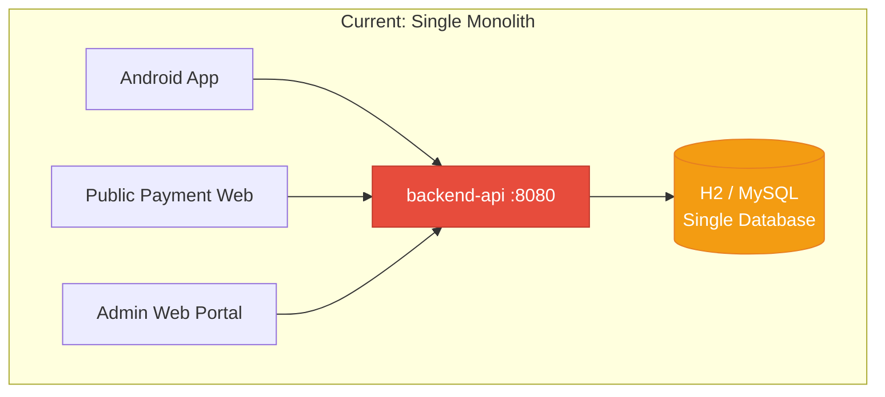
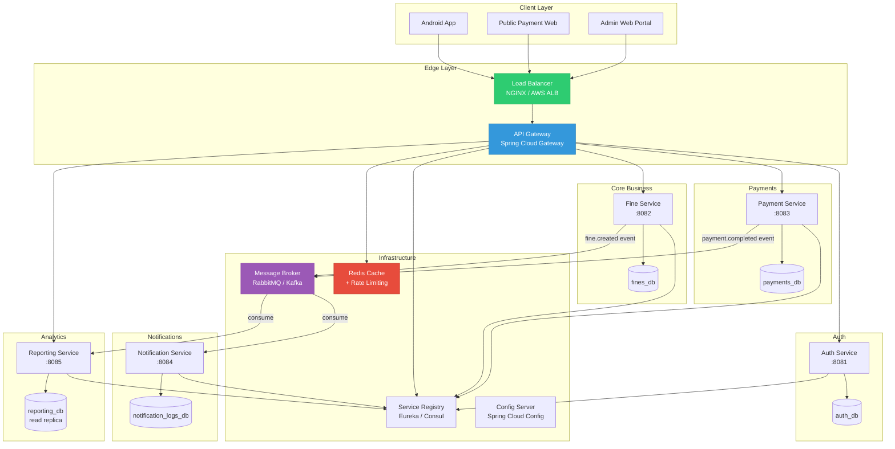
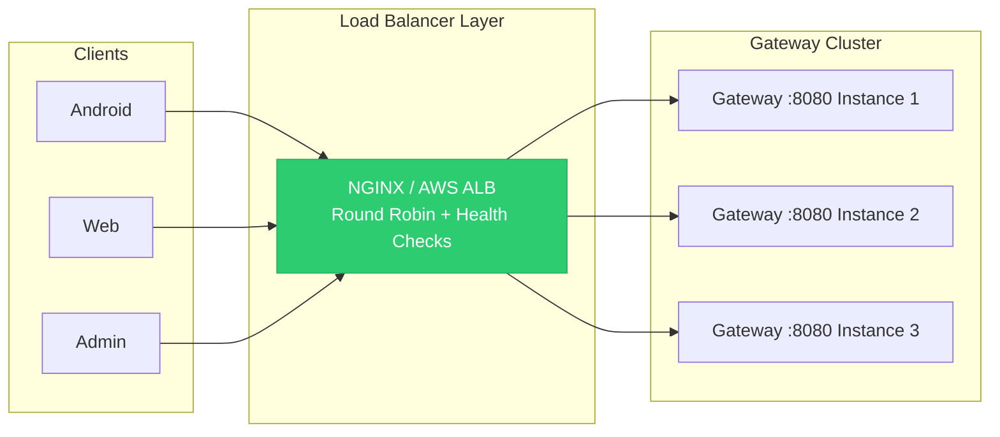
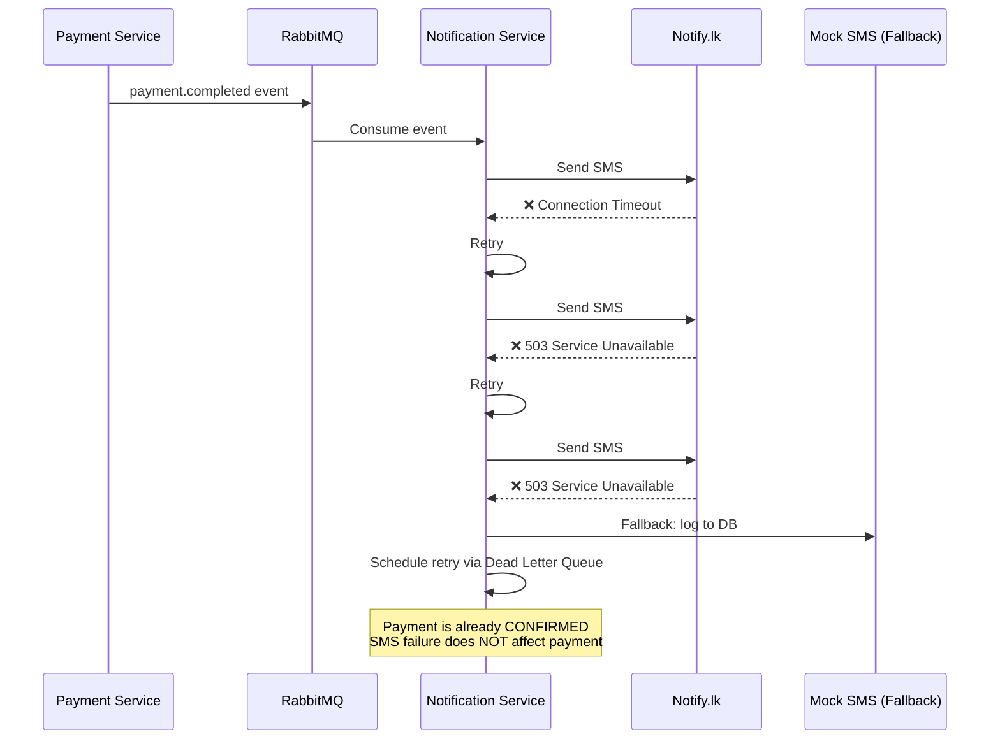
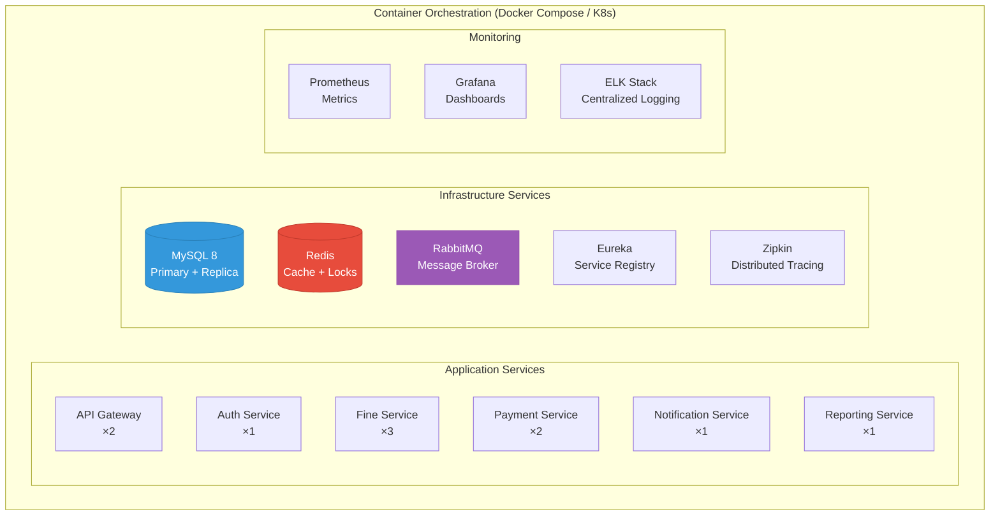

# Traffic Fine System — Microservices Architecture Analysis

## 1. Current Architecture Assessment

Your project is a **classic monolithic architecture** — a single Spring Boot `backend-api` serves **all** responsibilities:



### What the monolith currently bundles together:

| Concern | Files | Risk if Coupled |
|---|---|---|
| **Authentication & JWT** | `AuthService`, `JwtService`, `SecurityConfig` | Every service restart invalidates all sessions |
| **Fine Management** | `FineService`, `FineController`, `TrafficFineRepository` | Can't scale reads independently |
| **Payment Processing** | `PaymentService`, `PayHereService`, `MockPaymentGateway` | Payment spike takes down the entire system |
| **SMS Notifications** | `SmsService`, `MockSmsProvider`, `NotifyLkSmsProvider` | SMS provider timeout blocks payment response |
| **Admin Reporting** | `AdminReportService`, `AdminController` | Heavy reporting queries starve payment endpoints |
| **Data Seeding** | `DataSeeder` | Deployment concern mixed with application logic |

### Key Problems Identified

> [!CAUTION]
> **Critical Issues for a Real-World Deployment**

1. **Single point of failure** — If `backend-api` crashes, *everything* is offline: payments, lookups, admin dashboard, SMS
2. **No horizontal scaling** — One instance handles all traffic; no load balancing
3. **Synchronous SMS** — [SmsService.java](file:///Users/chamindu/Documents/GitHub/traffic-fine-system/backend-api/src/main/java/com/trafficfine/service/SmsService.java#L38-L48) calls SMS providers *inside* the payment transaction
4. **All endpoints `.permitAll()`** — [SecurityConfig.java:L44-46](file:///Users/chamindu/Documents/GitHub/traffic-fine-system/backend-api/src/main/java/com/trafficfine/security/SecurityConfig.java#L44-L46): `.anyRequest().permitAll()` — admin endpoints are unprotected
5. **In-memory H2 database** — Data is lost on every restart
6. **`java.util.Random` for reference numbers** — [FineService.java:L77](file:///Users/chamindu/Documents/GitHub/traffic-fine-system/backend-api/src/main/java/com/trafficfine/service/FineService.java#L77): Not cryptographically secure, collision risk under load
7. **No rate limiting** — Payment endpoints are open to abuse
8. **No circuit breaker** — PayHere or SMS provider downtime cascades into full system failure
9. **CORS allows all origins** — `setAllowedOrigins(List.of("*"))` in production is a security hole

---

## 2. Proposed Microservices Architecture



---

## 3. Service Decomposition — Detailed Breakdown

### 3.1 API Gateway (Spring Cloud Gateway)

**Why**: Single entry point for all clients. Handles cross-cutting concerns.

| Responsibility | How |
|---|---|
| **Routing** | Route `/api/auth/**` → Auth Service, `/api/fines/**` → Fine Service, etc. |
| **Rate Limiting** | Redis-backed: 100 req/min for payment endpoints, 1000 req/min for lookups |
| **JWT Validation** | Validate tokens at the gateway; pass `X-User-Id` and `X-User-Role` headers downstream |
| **CORS** | Centralized CORS config instead of per-service |
| **Circuit Breaker** | Resilience4j fallback if a downstream service is down |
| **Request Logging** | Centralized access logs, request tracing (Zipkin / Sleuth) |

```yaml
# Gateway route example
spring:
  cloud:
    gateway:
      routes:
        - id: fine-service
          uri: lb://fine-service
          predicates:
            - Path=/api/fines/**
          filters:
            - name: RequestRateLimiter
              args:
                redis-rate-limiter:
                  replenishRate: 50
                  burstCapacity: 100
        - id: payment-service
          uri: lb://payment-service
          predicates:
            - Path=/api/payments/**
          filters:
            - name: CircuitBreaker
              args:
                name: paymentCircuitBreaker
                fallbackUri: forward:/fallback/payment
```

---

### 3.2 Auth Service (`:8081`)

**Source mapping**: [AuthService.java](file:///Users/chamindu/Documents/GitHub/traffic-fine-system/backend-api/src/main/java/com/trafficfine/service/AuthService.java), [JwtService.java](file:///Users/chamindu/Documents/GitHub/traffic-fine-system/backend-api/src/main/java/com/trafficfine/security/JwtService.java), [SecurityConfig.java](file:///Users/chamindu/Documents/GitHub/traffic-fine-system/backend-api/src/main/java/com/trafficfine/security/SecurityConfig.java)

| Feature | Details |
|---|---|
| Database | Dedicated `auth_db` — users, roles, refresh tokens |
| Endpoints | `POST /api/auth/login`, `POST /api/auth/refresh`, `POST /api/auth/logout` |
| Token Storage | Store refresh tokens in Redis with TTL |
| Scaling | Low traffic, 1–2 instances |

> [!IMPORTANT]
> **Critical Fix Needed**: Your current [SecurityConfig](file:///Users/chamindu/Documents/GitHub/traffic-fine-system/backend-api/src/main/java/com/trafficfine/security/SecurityConfig.java#L44-L46) sets `.anyRequest().permitAll()`. In microservices, JWT validation moves to the API Gateway, and each service validates the `X-User-Role` header for admin-only endpoints.

---

### 3.3 Fine Service (`:8082`)

**Source mapping**: [FineService.java](file:///Users/chamindu/Documents/GitHub/traffic-fine-system/backend-api/src/main/java/com/trafficfine/service/FineService.java), [FineController.java](file:///Users/chamindu/Documents/GitHub/traffic-fine-system/backend-api/src/main/java/com/trafficfine/controller/FineController.java), [TrafficFine.java](file:///Users/chamindu/Documents/GitHub/traffic-fine-system/backend-api/src/main/java/com/trafficfine/entity/TrafficFine.java)

| Feature | Details |
|---|---|
| Database | `fines_db` — traffic_fines, fine_categories, officers |
| Endpoints | `GET /api/fines/lookup`, `POST /api/fines`, `GET /api/fines/{id}` |
| Caching | Redis cache for fine lookups (TTL 5 min) — most lookups are read-heavy |
| Events Published | `fine.created`, `fine.status.changed` → Message Broker |
| Scaling | **High read traffic** (lookups) → 3–5 instances with read replicas |

```java
// Improved: Use UUID-based reference numbers
private String generateUniqueReferenceNumber() {
    return "TF" + UUID.randomUUID().toString()
            .replace("-", "").substring(0, 10).toUpperCase();
}
```

---

### 3.4 Payment Service (`:8083`) — **Most Critical**

**Source mapping**: [PaymentService.java](file:///Users/chamindu/Documents/GitHub/traffic-fine-system/backend-api/src/main/java/com/trafficfine/service/PaymentService.java), [PayHereService.java](file:///Users/chamindu/Documents/GitHub/traffic-fine-system/backend-api/src/main/java/com/trafficfine/service/PayHereService.java), [MockPaymentGateway.java](file:///Users/chamindu/Documents/GitHub/traffic-fine-system/backend-api/src/main/java/com/trafficfine/integration/MockPaymentGateway.java)

| Feature | Details |
|---|---|
| Database | `payments_db` — payments table only |
| Endpoints | `POST /api/payments`, `POST /api/payments/initiate`, `POST /api/payments/notify` |
| Pattern | **Saga Pattern** — coordinates with Fine Service via events |
| Events Published | `payment.completed`, `payment.failed` → Message Broker |
| Idempotency | Idempotency key per request to prevent double-charging |
| Circuit Breaker | Resilience4j around PayHere API calls |
| Scaling | **Medium traffic, high importance** → 2–3 instances |

> [!WARNING]
> **Current Problem**: In [PaymentService.pay()](file:///Users/chamindu/Documents/GitHub/traffic-fine-system/backend-api/src/main/java/com/trafficfine/service/PaymentService.java#L39-L74), SMS is sent **synchronously inside the `@Transactional` block**. If SMS fails or times out, the entire payment transaction rolls back — the driver is charged but the fine stays UNPAID.

**Fix with event-driven architecture:**

```java
// Payment Service — publish event, don't call SMS directly
@Transactional
public PaymentResponse pay(PaymentRequest request) {
    // ... validate and charge ...
    
    Payment payment = paymentRepository.save(/*...*/);
    fine.markPaid(paidAt);
    fineService.updateFineStatus(fine.getId(), FineStatus.PAID); // Inter-service call
    
    // Publish event instead of synchronous SMS
    eventPublisher.publish(new PaymentCompletedEvent(
        payment.getPaymentReference(),
        fine.getReferenceNumber(),
        fine.getOfficer().getPhoneNumber()
    ));
    
    return new PaymentResponse(/*...*/);
}
```

---

### 3.5 Notification Service (`:8084`) — **Event-Driven**

**Source mapping**: [SmsService.java](file:///Users/chamindu/Documents/GitHub/traffic-fine-system/backend-api/src/main/java/com/trafficfine/service/SmsService.java), [MockSmsProvider.java](file:///Users/chamindu/Documents/GitHub/traffic-fine-system/backend-api/src/main/java/com/trafficfine/sms/MockSmsProvider.java), [NotifyLkSmsProvider.java](file:///Users/chamindu/Documents/GitHub/traffic-fine-system/backend-api/src/main/java/com/trafficfine/sms/NotifyLkSmsProvider.java)

| Feature | Details |
|---|---|
| Database | `notification_logs_db` — sms_logs, email_logs |
| Trigger | Consumes `payment.completed` events from Message Broker |
| Retry | Automatic retry with exponential backoff (3 attempts) |
| Future Channels | Email, Push Notifications, WhatsApp — all from one service |
| Scaling | 1–2 instances (asynchronous, can process at its own pace) |

```java
// Event consumer — completely decoupled from payment flow
@RabbitListener(queues = "payment.completed")
public void onPaymentCompleted(PaymentCompletedEvent event) {
    String message = "Payment confirmed for fine " + event.referenceNumber() 
                   + ". Driver license can be released.";
    
    try {
        smsProvider.sendSms(event.officerPhone(), message);
        logSuccess(event);
    } catch (Exception e) {
        logFailure(event, e);
        // Message stays in queue for retry — payment is NOT affected
    }
}
```

---

### 3.6 Reporting Service (`:8085`) — **CQRS Pattern**

**Source mapping**: [AdminReportService.java](file:///Users/chamindu/Documents/GitHub/traffic-fine-system/backend-api/src/main/java/com/trafficfine/service/AdminReportService.java), [AdminController.java](file:///Users/chamindu/Documents/GitHub/traffic-fine-system/backend-api/src/main/java/com/trafficfine/controller/AdminController.java)

| Feature | Details |
|---|---|
| Database | **Read replica** or materialized views — never query the transactional DB |
| Pattern | CQRS (Command Query Responsibility Segregation) |
| Data Source | Consumes `fine.created`, `payment.completed` events to build its own read-optimized data |
| Caching | Pre-computed dashboard metrics in Redis (refresh every 30s) |
| Scaling | 1–2 instances; can be down without affecting payments |

> [!TIP]
> **Why CQRS matters here**: Your current [AdminReportService.dashboard()](file:///Users/chamindu/Documents/GitHub/traffic-fine-system/backend-api/src/main/java/com/trafficfine/service/AdminReportService.java#L33-L41) runs 5 aggregate queries (`totalCollected`, `countByStatus` × 3, `districtWiseCollections`, `categoryWiseCollections`) on the same database that handles payments. During a traffic fine payment rush (e.g., end-of-month deadline), these heavy `GROUP BY` queries will lock rows and slow down payment processing.

---

## 4. Load Balancing Strategies

### 4.1 External Load Balancer (Client → Gateway)



| Strategy | When to Use | Config |
|---|---|---|
| **Round Robin** | Default for gateway instances | Even traffic distribution |
| **Least Connections** | When some requests (payments) take longer | Routes to the least-busy instance |
| **IP Hash** | Sticky sessions (not needed with JWT) | Same client → same instance |
| **Weighted** | Gradual rollout of new versions | New version gets 10% traffic initially |

### 4.2 Internal Load Balancing (Gateway → Microservices)

Use **Spring Cloud LoadBalancer** (client-side) with **Eureka Service Registry**:

```yaml
# Each microservice registers itself
eureka:
  client:
    service-url:
      defaultZone: http://eureka:8761/eureka/
  instance:
    prefer-ip-address: true
```

The gateway uses service names (`lb://fine-service`) to discover and load-balance across all registered instances.

### 4.3 Database Load Balancing

| Pattern | What | Why |
|---|---|---|
| **Read Replicas** | MySQL primary + 2 read replicas for Fine Service | Fine lookups are 10x more frequent than writes |
| **Connection Pooling** | HikariCP with max 20 connections per service | Prevent DB connection exhaustion |
| **Sharding** (future) | Shard fines by district | District-level isolation for Sri Lanka's 25 districts |

---

## 5. Real-World Scenarios & Solutions

### 5.1 🚦 Scenario: End-of-Month Payment Rush

**Problem**: Thousands of drivers try to pay fines before the deadline.

**Solution stack:**

| Layer | Action |
|---|---|
| **Auto-scaling** | Payment Service: scale from 2 → 8 instances based on CPU > 70% |
| **Rate Limiting** | Gateway: max 100 payments/min per IP; 5000 total/min |
| **Queue Buffering** | If PayHere is overloaded, queue payments and process asynchronously |
| **Circuit Breaker** | If PayHere fails 5 times in 30 seconds, open circuit and return "try again later" |
| **Cache** | Fine lookups served from Redis; don't hit DB for repeated lookups |

### 5.2 📱 Scenario: SMS Provider Outage (Notify.lk Down)

**Problem**: SMS gateway goes offline; officers never get notified.



**Key principle**: Payment confirmation and SMS notification are **eventually consistent** — the payment succeeds immediately, and the SMS will be delivered when the provider recovers.

### 5.3 💳 Scenario: Double Payment (Race Condition)

**Problem**: Driver opens payment on both Android app and web browser simultaneously.

**Current vulnerability in your code** — [PaymentService.pay()](file:///Users/chamindu/Documents/GitHub/traffic-fine-system/backend-api/src/main/java/com/trafficfine/service/PaymentService.java#L39-L74):

```java
// ⚠️ Race condition window between check and update
if (fine.getStatus() == FineStatus.PAID) {  // Thread A reads UNPAID
    throw new BusinessRuleException(...);
}
// Thread B also reads UNPAID before Thread A commits
```

**Solutions:**

```java
// Option 1: Database-level pessimistic lock
@Lock(LockModeType.PESSIMISTIC_WRITE)
@Query("SELECT f FROM TrafficFine f WHERE f.referenceNumber = :refNum")
Optional<TrafficFine> findByReferenceNumberForUpdate(@Param("refNum") String refNum);

// Option 2: Distributed lock with Redis
@Transactional
public PaymentResponse pay(PaymentRequest request) {
    String lockKey = "payment:lock:" + request.referenceNumber();
    boolean acquired = redisTemplate.opsForValue()
            .setIfAbsent(lockKey, "locked", Duration.ofSeconds(30));
    if (!acquired) {
        throw new BusinessRuleException("Payment is being processed");
    }
    try {
        // ... process payment ...
    } finally {
        redisTemplate.delete(lockKey);
    }
}

// Option 3: Idempotency key (best for APIs)
@PostMapping
public PaymentResponse pay(
        @RequestHeader("Idempotency-Key") String idempotencyKey,
        @Valid @RequestBody PaymentRequest request) {
    // Check if this exact request was already processed
    return paymentService.payIdempotent(idempotencyKey, request);
}
```

### 5.4 🌐 Scenario: Service Cascading Failure

**Problem**: Fine Service is overloaded → Payment Service can't validate fines → Payments fail → Users retry → More load → System collapse.

**Solution: Circuit Breaker Pattern (Resilience4j)**

```java
@CircuitBreaker(name = "fineService", fallbackMethod = "fineLookupFallback")
@Retry(name = "fineService")
@TimeLimiter(name = "fineService")
public CompletableFuture<FineLookupResponse> lookupFine(String refNum, String catCode) {
    return CompletableFuture.supplyAsync(() -> 
        fineServiceClient.lookup(refNum, catCode)
    );
}

// Fallback: return cached version or graceful error
public CompletableFuture<FineLookupResponse> fineLookupFallback(
        String refNum, String catCode, Throwable t) {
    // Try Redis cache first
    FineLookupResponse cached = redisTemplate.opsForValue()
            .get("fine:" + refNum + ":" + catCode);
    if (cached != null) return CompletableFuture.completedFuture(cached);
    throw new ServiceUnavailableException("Fine lookup is temporarily unavailable");
}
```

### 5.5 🔒 Scenario: Security — Admin Dashboard Data Leak

**Current state**: [SecurityConfig.java](file:///Users/chamindu/Documents/GitHub/traffic-fine-system/backend-api/src/main/java/com/trafficfine/security/SecurityConfig.java#L44-L46) has `.anyRequest().permitAll()` — **anyone can access** `GET /api/admin/dashboard` and `GET /api/admin/fines` without authentication.

**Microservices fix**: Gateway-level authorization:

```yaml
# API Gateway route with role enforcement
- id: admin-service
  uri: lb://reporting-service
  predicates:
    - Path=/api/admin/**
  filters:
    - name: JwtAuthFilter
    - name: RoleFilter
      args:
        requiredRole: ADMIN
```

### 5.6 📊 Scenario: Nationwide Scale (25 Districts × Peak Hours)

**Traffic estimation** for Sri Lanka Traffic Police:

| Metric | Estimate |
|---|---|
| Active fines per month | ~50,000 |
| Peak payments/hour | ~2,000 (month-end) |
| Fine lookups/hour | ~10,000 (lookups before payment) |
| Admin dashboard hits/hour | ~200 |
| SMS notifications/hour | ~2,000 |

**Scaling plan:**

| Service | Min Instances | Max Instances | Auto-scale Trigger |
|---|---|---|---|
| API Gateway | 2 | 5 | CPU > 60% |
| Auth Service | 1 | 2 | CPU > 70% |
| Fine Service | 3 | 8 | Request latency > 500ms |
| Payment Service | 2 | 6 | Queue depth > 100 |
| Notification Service | 1 | 3 | Queue depth > 500 |
| Reporting Service | 1 | 2 | CPU > 80% |

---

## 6. Recommended New Repository Structure

```
traffic-fine-system/
├── api-gateway/                     # Spring Cloud Gateway
│   ├── src/
│   └── pom.xml
├── service-registry/                # Eureka Server
│   ├── src/
│   └── pom.xml
├── config-server/                   # Spring Cloud Config
│   ├── src/
│   └── pom.xml
├── auth-service/                    # Authentication & JWT
│   ├── src/
│   └── pom.xml
├── fine-service/                    # Fine management (CRUD + lookup)
│   ├── src/
│   └── pom.xml
├── payment-service/                 # Payment processing + PayHere
│   ├── src/
│   └── pom.xml
├── notification-service/            # SMS, Email, Push notifications
│   ├── src/
│   └── pom.xml
├── reporting-service/               # Admin dashboard & analytics
│   ├── src/
│   └── pom.xml
├── common-lib/                      # Shared DTOs, exceptions, utils
│   ├── src/
│   └── pom.xml
├── android-app/                     # (unchanged)
├── public-payment-web/              # (unchanged)
├── admin-web-portal/                # (unchanged)
├── docker-compose.yml               # Full stack orchestration
├── docker-compose.infra.yml         # MySQL, Redis, RabbitMQ, Eureka
└── docs/
    ├── architecture-diagram.md
    └── api-contracts/
```

---

## 7. Infrastructure Stack



### Docker Compose for Development

```yaml
version: '3.8'
services:
  mysql-primary:
    image: mysql:8.0
    environment:
      MYSQL_ROOT_PASSWORD: root
    ports:
      - "3306:3306"
    volumes:
      - mysql_data:/var/lib/mysql
      - ./init-databases.sql:/docker-entrypoint-initdb.d/init.sql

  redis:
    image: redis:7-alpine
    ports:
      - "6379:6379"

  rabbitmq:
    image: rabbitmq:3-management
    ports:
      - "5672:5672"
      - "15672:15672"

  eureka:
    build: ./service-registry
    ports:
      - "8761:8761"

  api-gateway:
    build: ./api-gateway
    ports:
      - "8080:8080"
    depends_on:
      - eureka
      - redis
    deploy:
      replicas: 2

  fine-service:
    build: ./fine-service
    depends_on:
      - mysql-primary
      - eureka
      - redis
    deploy:
      replicas: 3

  payment-service:
    build: ./payment-service
    depends_on:
      - mysql-primary
      - eureka
      - rabbitmq
    deploy:
      replicas: 2

  notification-service:
    build: ./notification-service
    depends_on:
      - mysql-primary
      - rabbitmq
    deploy:
      replicas: 1

  reporting-service:
    build: ./reporting-service
    depends_on:
      - mysql-primary
      - eureka
      - redis
    deploy:
      replicas: 1
```

---

## 8. Migration Strategy (Strangler Fig Pattern)

Don't rewrite everything at once. Incrementally extract services:

```mermaid
graph LR
    subgraph "Phase 1: Foundation"
        P1A[Add API Gateway<br/>in front of monolith]
        P1B[Add Service Registry]
        P1C[Add Redis Cache]
    end
    
    subgraph "Phase 2: Extract Notifications"
        P2A[Extract SMS to<br/>Notification Service]
        P2B[Add RabbitMQ]
        P2C[Make SMS async]
    end
    
    subgraph "Phase 3: Extract Payments"
        P3A[Extract Payment<br/>Service]
        P3B[Add Circuit Breaker]
        P3C[Add Idempotency]
    end
    
    subgraph "Phase 4: Extract Core"
        P4A[Extract Fine Service]
        P4B[Extract Auth Service]
        P4C[Extract Reporting<br/>Service]
    end
    
    P1A --> P1B --> P1C --> P2A --> P2B --> P2C --> P3A --> P3B --> P3C --> P4A --> P4B --> P4C
```



| Phase | Duration | Risk | Benefit |
|---|---|---|---|
| **Phase 1**: Gateway + Registry | 1 week | Low | Load balancing, centralized routing |
| **Phase 2**: Extract Notifications | 1 week | Low | SMS failures no longer affect payments |
| **Phase 3**: Extract Payments | 2 weeks | Medium | Independent payment scaling, circuit breakers |
| **Phase 4**: Extract Core | 2 weeks | Medium | Full microservices, independent deployments |

---

## 9. Quick Wins — Improvements Without Full Microservices

These can be applied to your **current monolith** immediately:

| # | Fix | File | Impact |
|---|---|---|---|
| 1 | **Fix security**: Change `.anyRequest().permitAll()` to require `ADMIN` for `/api/admin/**` | [SecurityConfig.java:L44](file:///Users/chamindu/Documents/GitHub/traffic-fine-system/backend-api/src/main/java/com/trafficfine/security/SecurityConfig.java#L44) | 🔴 Critical |
| 2 | **Make SMS async**: Use `@Async` + `@EnableAsync` on `SmsService.sendPaymentConfirmation()` | [SmsService.java:L38](file:///Users/chamindu/Documents/GitHub/traffic-fine-system/backend-api/src/main/java/com/trafficfine/service/SmsService.java#L38) | 🔴 Critical |
| 3 | **Add pessimistic lock** on fine lookup during payment to prevent double-pay race condition | [TrafficFineRepository.java](file:///Users/chamindu/Documents/GitHub/traffic-fine-system/backend-api/src/main/java/com/trafficfine/repository/TrafficFineRepository.java) | 🔴 Critical |
| 4 | **Restrict CORS**: Replace `"*"` with actual frontend origins | [SecurityConfig.java:L29](file:///Users/chamindu/Documents/GitHub/traffic-fine-system/backend-api/src/main/java/com/trafficfine/security/SecurityConfig.java#L29) | 🟡 High |
| 5 | **Switch from H2 to MySQL/PostgreSQL** for production persistence | [application.yml:L8](file:///Users/chamindu/Documents/GitHub/traffic-fine-system/backend-api/src/main/resources/application.yml#L8) | 🟡 High |
| 6 | **Use `SecureRandom`** instead of `Random` for reference numbers | [FineService.java:L77](file:///Users/chamindu/Documents/GitHub/traffic-fine-system/backend-api/src/main/java/com/trafficfine/service/FineService.java#L77) | 🟡 Medium |
| 7 | **Add Actuator + health checks** for monitoring readiness | [pom.xml](file:///Users/chamindu/Documents/GitHub/traffic-fine-system/backend-api/pom.xml) | 🟢 Medium |
| 8 | **Externalize JWT secret** — current default is hardcoded in `application.yml` | [application.yml:L26](file:///Users/chamindu/Documents/GitHub/traffic-fine-system/backend-api/src/main/resources/application.yml#L26) | 🟡 High |

---

## 10. Technology Recommendations Summary

| Concern | Technology | Why |
|---|---|---|
| API Gateway | Spring Cloud Gateway | Native Spring ecosystem; reactive |
| Service Discovery | Eureka | Simple setup; Spring native |
| Config Management | Spring Cloud Config | Centralized configs; Git-backed |
| Message Broker | RabbitMQ | Good for event-driven; easy management UI |
| Caching | Redis | Rate limiting + distributed locks + cache |
| Circuit Breaker | Resilience4j | Lightweight; Spring Boot starter available |
| Distributed Tracing | Micrometer + Zipkin | Track requests across services |
| Containerization | Docker + Docker Compose | Dev parity; consistent environments |
| Production Orchestration | Kubernetes (future) | Auto-scaling, self-healing, rolling updates |
| Monitoring | Prometheus + Grafana | Industry standard; free |
| Centralized Logging | ELK Stack (Elasticsearch, Logstash, Kibana) | Search across all service logs |
